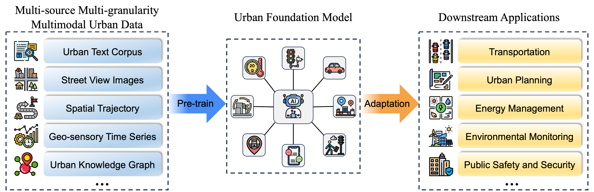
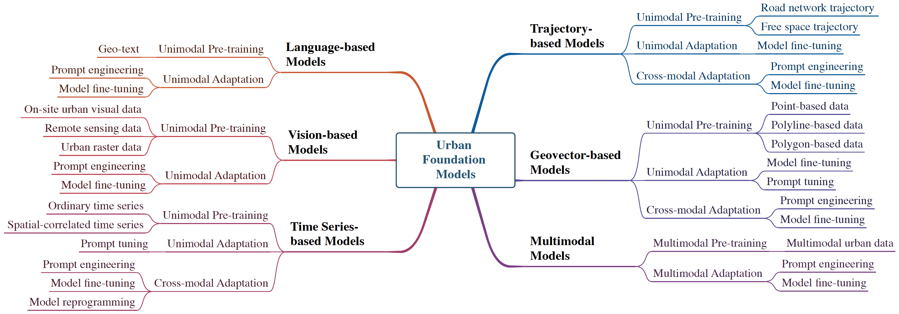

# Awesome-Urban-Foundation-Models

<p align="center">

[](https://awesome.re)


</p>

An Awesome Collection of Urban Foundation Models (UFMs).

<a id="news"></a>
## News  🎉
🌟 2025-01: We update a significantly extended version in [Towards Urban General Intelligence: A Review and Outlook of Urban Foundation Models](https://arxiv.org/abs/2402.01749), where we formally define and conceptualize Urban General Intelligence; propose a forward-looking general framework for the development of versatile UFMs; integrate the up-to-date literature on UFMs, adding a new section on geovector-based UFMs and several subsections, etc.

🌟 2024-05: [Urban Foundation Models: A Survey](https://dl.acm.org/doi/10.1145/3637528.3671453) has been accepted as a Tutorial Track Paper at KDD'24 and will be published in the conference proceedings. Additionally, we will host a tutorial on Urban Foundation Models at the KDD'24 conference. More details can be found on the [Tutorial website](https://usail-hkust.github.io/Urban_Foundation_Model_Tutorial).


🌟 2024-02: This paper is spotlighted by the influential AI media [新智元](https://mp.weixin.qq.com/s/cPvYmvPHlBr3l2S5sj-7pQ).


## Urban Foundation Models (UFMs)
**Urban Foundation Models (UFMs)** are a family of large-scale models pre-trained on vast amounts of multi-source, multi-granularity, and multimodal urban data. They acquire notable general-purpose capabilities in the pre-training phase, exhibiting remarkable emergent abilities and adaptability dedicated to a range of urban application domains, such as transportation, urban planning, energy management, environmental monitoring, and public safety and security.

<!---->
<p align="center">
  
</p>

## Survey Paper

#### [KDD'24 Version]
[**Urban Foundation Models: A Survey**](https://dl.acm.org/doi/10.1145/3637528.3671453) 

**Authors**: [Weijia Zhang](https://scholar.google.com/citations?user=lSi3CIoAAAAJ&hl=en), [Jindong Han](https://scholar.google.com/citations?user=e9lFam0AAAAJ&hl=en), [Zhao Xu](https://xzbill.top/zhaoxu/), [Hang Ni](https://scholar.google.com/citations?user=2jk7gKYAAAAJ&hl=en), [Hao Liu](https://raymondhliu.github.io/), [Hui Xiong](https://scholar.google.com/citations?user=cVDF1tkAAAAJ&hl=en)

</p>
</p>

#### [Extended Version] 
[**Towards Urban General Intelligence: A Review and Outlook of Urban Foundation Models**](https://arxiv.org/abs/2402.01749)  
  
**Authors**: [Weijia Zhang](https://scholar.google.com/citations?user=lSi3CIoAAAAJ&hl=en), [Jindong Han](https://scholar.google.com/citations?user=e9lFam0AAAAJ&hl=en), [Zhao Xu](https://xzbill.top/zhaoxu/), [Hang Ni](https://scholar.google.com/citations?user=2jk7gKYAAAAJ&hl=en), [Tengfei Lyu](https://raymondhliu.github.io/), [Hao Liu](https://raymondhliu.github.io/), [Hui Xiong](https://scholar.google.com/citations?user=cVDF1tkAAAAJ&hl=en)

🌟 If you find this resource helpful, please consider starring this repository and citing our survey paper:

```
@inproceedings{ufmsurvey-kdd2024,
  title={Urban Foundation Models: A Survey},
  author={Zhang, Weijia and Han, Jindong and Xu, Zhao and Ni, Hang and Liu, Hao and Xiong, Hui},
  booktitle={Proceedings of the 30th ACM SIGKDD Conference on Knowledge Discovery and Data Mining},
  pages={6633--6643},
  year={2024}
}
```

```
@misc{zhang2024urban,
      title={Towards Urban General Intelligence: A Review and Outlook of Urban Foundation Models}, 
      author={Weijia Zhang and Jindong Han and Zhao Xu and Hang Ni and Tengfei Lyu and Hao Liu and Hui Xiong},
      year={2024},
      eprint={2402.01749},
      archivePrefix={arXiv},
      primaryClass={cs.CY}
}
```


## Outline
- [Awesome-Urban-Foundation-Models](#awesome-urban-foundation-models)
  - [News](#news)
  - [Urban Foundation Models (UFMs)](#urban-foundation-models-ufms)
  - [Survey Paper](#survey-paper)
      - [\[KDD'24 Version\]](#kdd24-version)
      - [\[Extended Version\]](#extended-version)
  - [Outline](#outline)
    - [Taxonomy](#taxonomy)
  - [1. Language-based Models](#1-language-based-models)
    - [1.1 Unimodal Pre-training](#11-unimodal-pre-training)
      - [Geo-text](#geo-text)
    - [1.2 Unimodal Adaptation](#12-unimodal-adaptation)
      - [Prompt engineering](#prompt-engineering-language)
      - [Model fine-tuning](#model-fine-tuning-language)
  - [2. Vision-based Models](#2-vision-based-models)
    - [2.1 Unimodal Pre-training](#21-unimodal-pre-training)
      - [On-site visual data](#on-site-visual-data)
      - [Remote sensing data](#remote-sensing-data)
      - [Urban Raster data](#urban-raster-data)
    - [2.2 Unimodal Adaptation](#22-unimodal-adaptation)
      - [Prompt engineering](#prompt-engineering-vision)
      - [Model fine-tuning](#model-fine-tuning-vision)
  - [3. Time Series-based Models](#3-time-series-based-models)
    - [3.1 Unimodal Pre-training](#31-unimodal-pre-training)
      - [Ordinary time series](#ordinary-time-series)
      - [Spatial-correlated time series](#spatial-correlated-time-series)
    - [3.2 Unimodal Adaptation](#32-unimodal-adaptation)
      - [Prompt tuning](#prompt-tuning-ts)
    - [3.3 Cross-modal Adaptation](#33-cross-modal-adaptation)
      - [Prompt engineering](#prompt-engineering-ts)
      - [Model fine-tuning](#model-fine-tuning-ts)
      - [Model reprogramming](#model-reprogramming-ts)
  - [4. Trajectory-based Models](#4-trajectory-based-models)
    - [4.1 Unimodal Pre-training](#41-unimodal-pre-training)
      - [Road network trajectory](#road-network-trajectory)
      - [Free space trajectory](#free-space-trajectory)
    - [4.2 Unimodal Adaptation](#42-unimodal-adaptation)
      - [Model fine-tuning](#model-fine-tuning-trajectory-uni)
    - [4.3 Cross-modal Adaptation](#43-cross-modal-adaptation)
      - [Prompt engineering](#prompt-engineering-trajectory-cross)
  - [5. Geovector-based Models](#5-geovector-based-models)
    - [5.1 Unimodal Pre-training](#51-unimodal-pre-training)
      - [Point-based data](#point-based-data)
      - [Polyline-based data](#polyline-based-data)
      - [Polygon-based data](#polygon-based-data)
    - [5.2 Unimodal Adaptation](#52-unimodal-adaptation)
      - [Model fine-tuning](#model-fine-tuning-Geovector)
      - [Prompt tuning](#prompt-tuning-Geovector)
    - [5.3 Cross-modal Adaptation](#53-cross-modal-adaptation)
      - [Prompt engineering](#Prompt-engineering-Geovector)
      - [Model fine-tuning](#Model-fine-tuning-Geovector)
  - [6. Multimodal-based Models](#6-multimodal-based-models)
    - [6.1 Multimodal Pre-training](#61-multimodal-pre-training)
      - [Multimodal urban data](#multimodal-urban-data)
    - [6.2 Multimodal Adaptation](#62-multimodal-adaptation)
      - [Prompt engineering](#prompt-engineering-multimodal)
      - [Model fine-tuning](#model-fine-tuning-multimodal)
  - [7. Others](#7-others)
  - [8. Contributing](#8-contributing)


### Taxonomy

<!--  -->


## 1. Language-based Models

### 1.1 Unimodal Pre-training
#### Geo-text
- (*KDD'22*) ERNIE-GeoL: A Geography-and-Language Pre-trained Model and its Applications in Baidu Maps [[paper](https://dl.acm.org/doi/pdf/10.1145/3534678.3539021)]

### 1.2 Unimodal Adaptation
<a id="prompt-engineering-language"></a>
#### Prompt engineering
- (*Urban Informatics'24*) Towards Human-AI Collaborative Urban Science Research Enabled by Pre-trained Large Language Models [[paper](https://arxiv.org/abs/2305.11418)]
- (*ICLR'24*) GeoLLM: Extracting Geospatial Knowledge from Large Language Models [[paper](https://arxiv.org/abs/2310.06213)]
- (*arXiv 2023.10*) Can Large Language Models be Good Path Planners? A Benchmark and Investigation on Spatial-temporal Reasoning [[paper](https://arxiv.org/abs/2310.03249)]
- (*arXiv 2023.05*) GPT4GEO: How a Language Model Sees the World's Geography [[paper](https://arxiv.org/abs/2306.00020)]
- (*arXiv 2023.05*) On the Opportunities and Challenges of Foundation Models for Geospatial Artificial Intelligence [[paper](https://arxiv.org/abs/2304.06798)]
- (*arXiv 2023.05*) ChatGPT is on the Horizon: Could a Large Language Model be Suitable for Intelligent Traffic Safety Research and Applications? [[paper](https://arxiv.org/abs/2303.05382)]
- (*GIScience'23*) Evaluating the Effectiveness of Large Language Models in Representing Textual Descriptions of Geometry and Spatial Relations [[paper](https://arxiv.org/abs/2307.03678)]
- (*SIGSPATIAL'23*) Are Large Language Models Geospatially Knowledgeable? [[paper](https://dl.acm.org/doi/abs/10.1145/3589132.3625625)]
- (*SIGSPATIAL'23*) Towards Understanding the Geospatial Skills of ChatGPT: Taking a Geographic Information Systems (GIS) Exam [[paper](https://dl.acm.org/doi/abs/10.1145/3615886.3627745)]

<a id="model-fine-tuning-language"></a>
#### Model fine-tuning
- (*arXiv 2024.6*) CityGPT: Empowering Urban Spatial Cognition of Large Language Models [[paper](https://arxiv.org/abs/2406.13948)]
- (*arXiv 2024.6*) UrbanLLM: Autonomous Urban Activity Planning and Management with Large Language Models [[paper](https://arxiv.org/abs/2406.12360)]
- (*arXiv 2024.3*) LAMP: A Language Model on the Map [[paper](https://arxiv.org/abs/2403.09059)]
- (*WSDM'24*) K2: A Foundation Language Model for Geoscience Knowledge Understanding and Utilization [[paper](https://arxiv.org/abs/2306.05064)]
- (*EMNLP'23*) GeoLM: Empowering Language Models for Geospatially Grounded Language Understanding [[paper](https://aclanthology.org/2023.emnlp-main.317/)]
- (*KDD'23*) QUERT: Continual Pre-training of Language Model for Query Understanding in Travel Domain Search [[paper](https://dl.acm.org/doi/abs/10.1145/3580305.3599891)]
- (*TOIS'23*) Improving First-stage Retrieval of Point-of-interest Search by Pre-training Models [[paper](https://dl.acm.org/doi/full/10.1145/3631937)]
- (*EMNLP'22*) SpaBERT: A Pretrained Language Model from Geographic Data for Geo-Entity Representation [[paper](https://aclanthology.org/2022.findings-emnlp.200/)]


## 2. Vision-based Models
### 2.1 Unimodal Pre-training
#### On-site visual data
- (*WWW'23*) Knowledge-infused Contrastive Learning for Urban Imagery-based Socioeconomic Prediction [[paper](https://dl.acm.org/doi/abs/10.1145/3543507.3583876)]
- (*CIKM'22*) Predicting Multi-level Socioeconomic Indicators from Structural Urban Imagery [[paper](https://dl.acm.org/doi/abs/10.1145/3511808.3557153)]
- (*AAAI'20*) Urban2Vec: Incorporating Street View Imagery and POIs for Multi-Modal Urban Neighborhood Embedding [[paper](https://ojs.aaai.org/index.php/AAAI/article/view/5450)]

#### Remote sensing data
- (*TGRS'24*) Change-Agent: Toward Interactive Comprehensive Remote Sensing Change Interpretation and Analysis [[paper](https://ieeexplore.ieee.org/abstract/document/10591792)]
- (*JSTARS'24*) A Billion-scale Foundation Model for Remote Sensing Images [[paper](https://arxiv.org/abs/2304.05215)]
- (*TGRS'23*) A Decoupling Paradigm With Prompt Learning for Remote Sensing Image Change Captioning [[paper](https://ieeexplore.ieee.org/document/10271701)]
- (*TGRS'23*) Foundation Model-Based Multimodal Remote Sensing Data Classification [[paper](https://ieeexplore.ieee.org/abstract/document/10375372)]
- (*TGRS'23*) RingMo-Sense: Remote Sensing Foundation Model for Spatiotemporal Prediction via Spatiotemporal Evolution Disentangling [[paper](https://ieeexplore.ieee.org/abstract/document/10254320)]
- (*ICCV'23*) Towards Geospatial Foundation Models via Continual Pretraining [[paper](https://openaccess.thecvf.com/content/ICCV2023/html/Mendieta_Towards_Geospatial_Foundation_Models_via_Continual_Pretraining_ICCV_2023_paper.html)]
- (*ICCV'23*) Scale-MAE: A Scale-Aware Masked Autoencoder for Multiscale Geospatial Representation Learning [[paper](https://openaccess.thecvf.com/content/ICCV2023/html/Reed_Scale-MAE_A_Scale-Aware_Masked_Autoencoder_for_Multiscale_Geospatial_Representation_Learning_ICCV_2023_paper.html)]
- (*ICML'23*) CSP: Self-Supervised Contrastive Spatial Pre-Training for Geospatial-Visual Representations [[paper](https://dl.acm.org/doi/10.5555/3618408.3619389)]
- (*TGRS'22*) Advancing Plain Vision Transformer Toward Remote Sensing Foundation Model [[paper](https://ieeexplore.ieee.org/abstract/document/9956816)]
- (*TGRS'22*) RingMo: A Remote Sensing Foundation Model With Masked Image Modeling [[paper](https://ieeexplore.ieee.org/abstract/document/9844015)]

#### Urban Raster data
- (*arXiv 2024.05*) Aurora: A Foundation Model of the Atmosphere [[paper](https://arxiv.org/abs/2405.13063)]
- (*arXiv 2023.04*) FengWu: Pushing the Skillful Global Medium-range Weather Forecast beyond 10 Days Lead [[paper](https://arxiv.org/abs/2304.02948)]
- (*arXiv 2023.04*) W-MAE: Pre-trained Weather Model with Masked Autoencoder for Multi-variable Weather Forecasting [[paper](https://arxiv.org/abs/2304.08754)]
- (*Science'23*) Learning skillful medium-range global weather forecasting [[paper](https://www.science.org/doi/full/10.1126/science.adi2336)]
- (*Nature'23*) Accurate Medium-range Global Weather Forecasting with 3D Neural Networks [[paper](https://www.nature.com/articles/s41586-023-06185-3)]
- (*ICML'23*) ClimaX: A Foundation Model for Weather and Climate [[paper](https://icml.cc/virtual/2023/28654)]
- (*arXiv 2022.02*) FourCastNet: A Global Data-driven High-resolution Weather Model using Adaptive Fourier Neural Operators [[paper](https://arxiv.org/abs/2202.11214)]

### 2.2 Unimodal Adaptation
<a id="prompt-engineering-vision"></a>
#### Prompt engineering
- (*TGRS'24*) RSPrompter: Learning to Prompt for Remote Sensing Instance Segmentation based on Visual Foundation Model [[paper](https://ieeexplore.ieee.org/abstract/document/10409216)]
- (*NeurIPS'23*) SAMRS: Scaling-up Remote Sensing Segmentation Dataset with Segment Anything Model [[paper](https://arxiv.org/abs/2305.02034)]

<a id="model-fine-tuning-vision"></a>
#### Model fine-tuning
- (*arXiv 2023.11*) GeoSAM: Fine-tuning SAM with Sparse and Dense Visual Prompting for Automated Segmentation of Mobility Infrastructure [[paper](https://arxiv.org/abs/2311.11319)]
- (*arXiv 2023.02*) Learning Generalized Zero-Shot Learners for Open-Domain Image Geolocalization [[paper](https://arxiv.org/abs/2302.00275)]
- (*NeurIPS'23*) GeoCLIP: Clip-Inspired Alignment between Locations and Images for Effective Worldwide Geo-localization [[paper](https://proceedings.neurips.cc/paper_files/paper/2023/hash/1b57aaddf85ab01a2445a79c9edc1f4b-Abstract-Conference.html)]
- (*TGRS'23*) RingMo-SAM: A Foundation Model for Segment Anything in Multimodal Remote-Sensing Images [[paper](https://ieeexplore.ieee.org/abstract/document/10315957)]
- (*IJAEOG'22*) Migratable Urban Street Scene Sensing Method based on Vsion Language Pre-trained Model [[paper](https://www.sciencedirect.com/science/article/pii/S1569843222001807)]

## 3. Time Series-based Models
### 3.1 Unimodal Pre-training
#### Ordinary time series
- (*ICML'24*) A decoder-only foundation model for time-series forecasting [[paper](https://raw.githubusercontent.com/mlresearch/v235/main/assets/das24c/das24c.pdf)]
- (*arXiv 2024.03*) UniTS: Building a Unified Time Series Model [[paper](https://arxiv.org/pdf/2403.00131.pdf)]
- (*arXiv 2024.02*) Timer: Transformers for Time Series Analysis at Scale [[paper](https://arxiv.org/pdf/2402.02368.pdf)]
- (*arXiv 2024.02*) Generative Pretrained Hierarchical Transformer for Time Series Forecasting [[paper](https://arxiv.org/pdf/2402.16516.pdf)]
- (*arXiv 2024.02*) TimeSiam: A Pre-Training Framework for Siamese Time-Series Modeling [[paper](https://arxiv.org/pdf/2402.02475v1.pdf)]
- (*arXiv 2024.01*) TTMs: Fast Multi-level Tiny Time Mixers for Improved Zero-shot and Few-shot Forecasting of Multivariate Time Series [[paper](https://arxiv.org/pdf/2401.03955v3.pdf)]
- (*arXiv 2024.01*) Himtm: Hierarchical multi-scale masked time series modeling for long-term forecasting [[paper](https://arxiv.org/pdf/2401.05012.pdf)]
- (*arXiv 2023.12*) Prompt-based Domain Discrimination for Multi-source Time Series Domain Adaptation [[paper](https://arxiv.org/pdf/2312.12276)]
- (*arXiv 2023.11*) PT-Tuning: Bridging the Gap between Time Series Masked Reconstruction and Forecasting via Prompt Token Tuning [[paper](https://arxiv.org/pdf/2311.03768)]
- (*arXiv 2023.10*) UniTime: A Language-Empowered Unified Model for Cross-Domain Time Series Forecasting [[paper](https://arxiv.org/pdf/2310.09751)]
- (*arXiv 2023.03*) SimTS: Rethinking Contrastive Representation Learning for Time Series Forecasting [[paper](https://arxiv.org/pdf/2303.18205)]
- (*arXiv 2023.01*) Ti-MAE: Self-Supervised Masked Time Series Autoencoders [[paper](https://arxiv.org/pdf/2301.08871)]
- (*NeurIPS'23*) Forecastpfn: Synthetically-trained zero-shot forecasting [[paper](https://proceedings.neurips.cc/paper_files/paper/2023/file/0731f0e65559059eb9cd9d6f44ce2dd8-Paper-Conference.pdf)]
- (*NeurIPS'23*) SimMTM: A Simple Pre-Training Framework for Masked Time-Series Modeling [[paper](https://arxiv.org/pdf/2302.00861)]
- (*NeurIPS'23*) Lag-llama: Towards foundation models for time series forecasting [[paper](https://arxiv.org/pdf/2310.08278)]
- (*ICLR'23*) A Time Series is Worth 64 Words: Long-term Forecasting with Transformers [[paper](https://arxiv.org/pdf/2211.14730)]
- (*KDD'23*) TSMixer: Lightweight MLP-Mixer Model for Multivariate Time Series Forecasting [[paper](https://arxiv.org/pdf/2306.09364)]
- (*AAAI'22*) TS2Vec: Towards Universal Representation of Time Series [[paper](https://ojs.aaai.org/index.php/AAAI/article/view/20881/20640)]
- (*ICLR'22*) CoST: Contrastive Learning of Disentangled Seasonal-Trend Representations for Time Series Forecasting [[paper](https://arxiv.org/pdf/2202.01575)]
- (*TNNLS'22*) Self-Supervised Autoregressive Domain Adaptation for Time Series Data [[paper](https://ieeexplore.ieee.org/iel7/5962385/6104215/09804766.pdf)]
- (*IJCAI'21*) Time-Series Representation Learning via Temporal and Contextual Contrasting [[paper](https://arxiv.org/pdf/2106.14112)]
- (*ICLR'21*) Unsupervised Representation Learning for Time Series with Temporal Neighborhood Coding [[paper](https://arxiv.org/pdf/2106.00750)]
- (*AAAI'21*) Meta-Learning Framework with Applications to Zero-Shot Time-Series Forecasting [[paper](https://ojs.aaai.org/index.php/AAAI/article/view/17115/16922)]
- (*AAAI'21*) Time Series Domain Adaptation via Sparse Associative Structure Alignment [[paper](https://ojs.aaai.org/index.php/AAAI/article/view/16846/16653)]
- (*KDD'21*) A Transformer-based Framework for Multivariate Time Series Representation Learning [[paper](https://dl.acm.org/doi/pdf/10.1145/3447548.3467401)]
- (*KDD'20*) Multi-Source Deep Domain Adaptation with Weak Supervision for Time-Series Sensor Data [[paper](https://dl.acm.org/doi/pdf/10.1145/3394486.3403228)]
- (*NeurIPS'19*) Unsupervised Scalable Representation Learning for Multivariate Time Series [[paper](https://proceedings.neurips.cc/paper/2019/file/53c6de78244e9f528eb3e1cda69699bb-Paper.pdf)]

#### Spatial-correlated time series
- (*KDD'24*) UniST: A Prompt-Empowered Universal Model for Urban Spatio-Temporal Prediction [[paper](https://arxiv.org/abs/2402.11838)]
- (*NeurIPS'23*) GPT-ST: Generative Pre-Training of Spatio-Temporal Graph Neural Networks [[paper](https://arxiv.org/pdf/2311.04245)]
- (*CIKM'23*) Mask- and Contrast-Enhanced Spatio-Temporal Learning for Urban Flow Prediction [[paper](https://dl.acm.org/doi/pdf/10.1145/3583780.3614958)]
- (*CIKM'23*) Cross-city Few-Shot Traffic Forecasting via Traffic Pattern Bank [[paper](https://dl.acm.org/doi/pdf/10.1145/3583780.3614829)]
- (*KDD'23*) Transferable Graph Structure Learning for Graph-based Traffic Forecasting Across Cities [[paper](https://dl.acm.org/doi/pdf/10.1145/3580305.3599529)]
- (*KDD'22*) Selective Cross-City Transfer Learning for Traffic Prediction via Source City Region Re-Weighting [[paper](https://dl.acm.org/doi/pdf/10.1145/3534678.3539250)]
- (*WSDM'22*) ST-GSP: Spatial-Temporal Global Semantic Representation Learning for Urban Flow Prediction [[paper](https://dl.acm.org/doi/pdf/10.1145/3488560.3498444)]
- (*SIGSPATIAL'22*) When Do Contrastive Learning Signals Help Spatio-Temporal Graph Forecasting? [[paper](https://dl.acm.org/doi/pdf/10.1145/3557915.3560939)]
- (*KDD'22*) Pre-training Enhanced Spatial-temporal Graph Neural Network for Multivariate Time Series Forecasting [[paper](https://dl.acm.org/doi/pdf/10.1145/3534678.3539396)]
- (*WWW'19*) Learning from Multiple Cities: A Meta-Learning Approach for Spatial-Temporal Prediction [[paper](https://dl.acm.org/doi/pdf/10.1145/3308558.3313577)]
- (*IJCAI'18*) Cross-City Transfer Learning for Deep Spatio-Temporal Prediction [[paper](https://arxiv.org/pdf/1802.00386)]

### 3.2 Unimodal Adaptation
<a id="prompt-tuning-ts"></a>
#### Prompt tuning
- (*arXiv 2023.12*) Prompt-based Domain Discrimination for Multi-source Time Series Domain Adaptation [[paper](https://arxiv.org/pdf/2312.12276)]
- (*arXiv 2023.11*) PT-Tuning: Bridging the Gap between Time Series Masked Reconstruction and Forecasting via Prompt Token Tuning [[paper](https://arxiv.org/pdf/2311.03768)]
- (*arXiv 2023.05*) Spatial-temporal Prompt Learning for Federated Weather Forecasting [[paper](https://arxiv.org/pdf/2305.14244)]
- (*CIKM'23*) PromptST: Prompt-Enhanced Spatio-Temporal Multi-Attribute Prediction [[paper](https://dl.acm.org/doi/pdf/10.1145/3583780.3615016)]
- (*IJCAI'23*) Prompt Federated Learning for Weather Forecasting: Toward Foundation Models on Meteorological Data [[paper](https://arxiv.org/pdf/2301.09152)]


### 3.3 Cross-modal Adaptation
<a id="prompt-engineering-ts"></a>
#### Prompt engineering
- (*TKDE'22*) PromptCast: A New Prompt-based Learning Paradigm for Time Series Forecasting [[paper](https://ieeexplore.ieee.org/iel7/69/4358933/10356715.pdf)]
- (*NeurIPS'23*) Large Language Models Are Zero-Shot Time Series Forecasters [[paper](https://arxiv.org/pdf/2310.07820.pdf?trk=public_post_comment-text)]

<a id="model-fine-tuning-ts"></a>
#### Model fine-tuning
- (*arXiv 2024.02*) AutoTimes: Autoregressive Time Series Forecasters via Large Language Models [[paper](https://arxiv.org/pdf/2402.02370.pdf)]
- (*ICLR'24*) TEMPO: Prompt-based Generative Pre-trained Transformer for Time Series Forecasting [[paper](https://arxiv.org/pdf/2310.04948)]
- (*arXiv 2024.03*) TPLLM: A Traffic Prediction Framework Based on Pretrained Large Language Models [[paper](https://arxiv.org/pdf/2403.02221v1.pdf)]
- (*arXiv 2024.01*) How can large language models understand spatial-temporal data? [[paper](https://arxiv.org/pdf/2401.14192v1.pdf)]
- (*arXiv 2024.01*) Spatial-temporal large language model for traffic prediction [[paper](https://arxiv.org/pdf/2401.10134v2.pdf)]
- (*arXiv 2023.11*) One Fits All: Universal Time Series Analysis by Pretrained LM and Specially Designed Adaptors [[paper](https://arxiv.org/pdf/2311.14782)]
- (*arXiv 2023.11*) GATGPT: A Pre-trained Large Language Model with Graph Attention Network for Spatiotemporal Imputation [[paper](https://arxiv.org/pdf/2311.14332)]
- (*arXiv 2023.08*) LLM4TS: Two-Stage Fine-Tuning for Time-Series Forecasting with Pre-Trained LLMs [[paper](https://arxiv.org/pdf/2308.08469)]
- (*NeurIPS'23*) One Fits All: Power General Time Series Analysis by Pretrained LM [[paper](https://proceedings.neurips.cc/paper_files/paper/2023/hash/86c17de05579cde52025f9984e6e2ebb-Abstract-Conference.html)]


<a id="model-reprogramming-ts"></a>
#### Model reprogramming
- (*arXiv 2024.08*) Empowering Pre-Trained Language Models for Spatio-Temporal Forecasting via Decoupling Enhanced Discrete Reprogramming [[paper](https://arxiv.org/pdf/2408.14505)]
- (*KDD'24*) UrbanGPT: Spatio-Temporal Large Language Models [[paper](https://arxiv.org/pdf/2403.00813)]
- (*ICLR'24*) Time-LLM: Time Series Forecasting by Reprogramming Large Language Models [[paper](https://arxiv.org/pdf/2310.01728.pdf?trk=public_post_comment-text)]
- (*arXiv 2023.08*) TEST: Text Prototype Aligned Embedding to Activate LLM’s Ability for Time Series [[paper](https://arxiv.org/pdf/2308.08241)]

## 4. Trajectory-based Models
### 4.1 Unimodal Pre-training
#### Road network trajectory
- (*arXiv 2024.08*) TrajFM: A Vehicle Trajectory Foundation Model for Region and Task Transferability [[paper](https://arxiv.org/abs/2408.15251)]
- (*WWW'24*) More Than Routing: Joint GPS and Route Modeling for Refine Trajectory Representation Learning [[paper](https://arxiv.org/abs/2402.16915v1)]
- (*KDD'23*) Lightpath: Lightweight and scalable path representation learning [[paper](https://doi.org/10.1145/3580305.3599415)]
- (*ICDM'23*) Self-supervised Pre-training for Robust and Generic Spatial-Temporal Representations [[paper](https://users.wpi.edu/~yli15/Includes/23_ICDM_MingzhiCR.pdf)]
- (*TKDE'23*) Pre-Training General Trajectory Embeddings With Maximum Multi-View Entropy Coding [[paper](https://doi.org/10.1109/TKDE.2023.3347513)]
- (*ICDE'23*) Self-supervised trajectory representation learning with temporal regularities and travel semantics [[paper](https://doi.org/10.1109/ICDE55515.2023.00070)]
- (*VLDBJ'22*) Unified route representation learning for multi-modal transportation recommendation with spatiotemporal pre-training [[paper](https://doi.org/10.1007/s00778-022-00748-y)]
- (*CIKM'21*) Robust road network representation learning: When traffic patterns meet traveling semantics [[paper](https://doi.org/10.1145/3459637.3482293)]
- (*IJCAI'21*) Unsupervised path representation learning with curriculum negative sampling [[paper](https://www.ijcai.org/proceedings/2021/0452.pdf)]
- (*TIST'20*) Trembr: Exploring road networks for trajectory representation learning [[paper](https://doi.org/10.1145/3361741)]
- (*ICDE'18*) Deep representation learning for trajectory similarity computation [[paper](https://doi.org/10.1109/ICDE.2018.00062)]
- (*IJCNN'17*) Trajectory clustering via deep representation learning [[paper](https://doi.org/10.1109/IJCNN.2017.7966345)]

#### Free space trajectory
- (*AAAI'23*) Contrastive pre-training with adversarial perturbations for check-in sequence representation learning [[paper](https://doi.org/10.1609/aaai.v37i4.25546)]
- (*KBS'21*) Self-supervised human mobility learning for next location prediction and trajectory classification [[paper](https://doi.org/10.1016/j.knosys.2021.107214)]
- (*AAAI'21*) Pre-training context and time aware location embeddings from spatial-temporal trajectories for user next location prediction [[paper](https://doi.org/10.1609/aaai.v35i5.16548)]
- (*KDD'20*) Learning to simulate human mobility [[paper](https://doi.org/10.1145/3394486.3412862)]

### 4.2 Unimodal Adaptation
<a id="model-fine-tuning-trajectory-uni"></a>
#### Model fine-tuning
- (*ToW'23*) Pre-Training Across Different Cities for Next POI Recommendation [[paper](https://doi.org/10.1145/3605554)]
- (*TIST'23*) Doing more with less: overcoming data scarcity for poi recommendation via cross-region transfer [[paper](https://doi.org/10.1145/3511711)]
- (*CIKM'21*) Region invariant normalizing flows for mobility transfer [[paper](https://doi.org/10.1145/3459637.3482169)]

### 4.3 Cross-modal Adaptation
<a id="prompt-engineering-trajectory-cross"></a>
#### Prompt engineering
- (*arXiv 2024.03*) DrPlanner: Diagnosis and Repair of Motion Planners Using Large Language Models [[paper](https://arxiv.org/abs/2403.07470)]
- (*arXiv 2023.11*) Exploring Large Language Models for Human Mobility Prediction under Public Events [[paper](https://arxiv.org/abs/2311.17351)]
- (*arXiv 2023.10*) Large Language Models for Spatial Trajectory Patterns Mining [[paper](https://arxiv.org/abs/2310.04942)]
- (*arXiv 2023.10*) Gpt-driver: Learning to drive with gpt [[paper](https://arxiv.org/abs/2310.01415)]
- (*arXiv 2023.10*) Languagempc: Large language models as decision makers for autonomous driving [[paper](https://arxiv.org/abs/2310.03026)]
- (*arXiv 2023.09*) Can you text what is happening? Integrating pre-trained language encoders into trajectory prediction models for autonomous driving [[paper](https://arxiv.org/abs/2309.05282)]
- (*arXiv 2023.08*) Where would i go next? large language models as human mobility predictors [[paper](https://arxiv.org/abs/2308.15197)]


<a id="model-fine-tuning-trajectory-cross"></a>
#### Model fine-tuning
- (*TIV'24*) Traj-llm: A new exploration for empowering trajectory prediction with pre-trained large language models [[paper](https://ieeexplore.ieee.org/abstract/document/10574364)]
- (*SIGSPATIAL'22*) Leveraging language foundation models for human mobility forecasting [[paper](https://doi.org/10.1145/3557915.3561026)]


<a id="5-geovector-based-models"></a>
## 5. Geovector-based Models
<a id="51-unimodal-pre-training"></a>
### 5.1 Unimodal Pre-training
<a id="point-based-data"></a>
#### Point-based data
- (*CIKM'24*) G2PTL: A Geography-Graph Pre-trained Model [[paper](https://dl.acm.org/doi/abs/10.1145/3627673.3680023)]
- (*Applied Science'22*) GeoBERT: Pre-Training Geospatial Representation Learning on Point-of-Interest [[paper](https://www.mdpi.com/2076-3417/12/24/12942)]
- (*CIKM'21*) GeoVectors: A Linked Open Corpus of OpenStreetMap Embeddings on World Scale [[paper](https://dl.acm.org/doi/abs/10.1145/3459637.3482004)]
- (*TKDE'21*) Pre-Training Time-Aware Location Embeddings from Spatial-Temporal Trajectories [[paper](https://doi.org/10.1109/TKDE.2021.3057875)]

<a id="polyline-based-data"></a>
#### Polyline-based data
- (*CIKM'22*) Jointly Contrastive Representation Learning on Road Network and Trajectory [[paper](https://dl.acm.org/doi/abs/10.1145/3511808.3557370)]
- (*CIKM'21*) Robust road network representation learning: When traffic patterns meet traveling semantics [[paper](https://dl.acm.org/doi/abs/10.1145/3459637.3482293)]
- (*SIGSPATIAL'20*) Enabling Finer Grained Place Embeddings using Spatial Hierarchy from Human Mobility Trajectories [[paper](https://dl.acm.org/doi/abs/10.1145/3397536.3422229)]

<a id="polygon-based-data"></a>
#### Polygon-based data
- (*arXiv 2024.08*) Urban Region Pre-training and Prompting: A Graph-based Approach [[paper](https://arxiv.org/abs/2408.05920)]
- (*arXiv 2024.05*) Learning Geospatial Region Embedding with Heterogeneous Graph [[paper](https://www.arxiv.org/abs/2405.14135)]
- (*KDD'23*) Urban region representation learning with openstreetmap building footprints [[paper](https://dl.acm.org/doi/10.1145/3580305.3599538)]
- (*AAAI'20*) Learning Geo-Contextual Embeddings for Commuting Flow Prediction [[paper](https://doi.org/10.1609/aaai.v34i01.5425)]

<a id="52-unimodal-adaptation"></a>
### 5.2 Unimodal Adaptation
<a id="model-fine-tuning-Geovector"></a>
#### Model fine-tuning
- (*arXiv 2024.06*) Fine-tuning of Geospatial Foundation Models for Aboveground Biomass Estimation [[paper](https://arxiv.org/abs/2406.19888)]

<a id="prompt-tuning-Geovector"></a>
#### Prompt tuning
- (*AAAI'23*) Heterogeneous Region Embedding with Prompt Learning [[paper](https://doi.org/10.1609/aaai.v37i4.25625)]

<a id="53-cross-modal-adaptation"></a>
### 5.3 Cross-modal Adaptation
<a id="Prompt-engineering-Geovector"></a>
#### Prompt engineering
- (*Eval4NLP'23*) Zero-shot Probing of Pretrained Language Models for Geography Knowledge [[paper](https://doi.org/10.18653/v1/2023.eval4nlp-1.5)]

<a id="Model-fine-tuning-Geovector"></a>
#### Model fine-tuning
- (*EMNLP'24*) Pretraining and Finetuning Language Models on Geospatial Networks for Accurate Address Matching [[paper](https://doi.org/10.18653/v1/2024.emnlp-industry.58)]


## 6. Multimodal-based Models
### 6.1 Multimodal Pre-training
#### Multimodal urban data
- (*KDD'24*) ReFound: Crafting a Foundation Model for Urban Region Understanding upon Language and Visual Foundations [[paper](https://dl.acm.org/doi/abs/10.1145/3637528.3671992)]
- (*WWW'24*) UrbanCLIP: Learning Text-enhanced Urban Region Profiling with Contrastive Language-Image Pretraining from the Web [[paper](https://dl.acm.org/doi/abs/10.1145/3589334.3645378)]
- (*TITS'23*) Parallel Transportation in TransVerse: From Foundation Models to DeCAST [[paper](https://ieeexplore.ieee.org/document/10260246)]
- (*arXiv 2023.12*) AllSpark: A Multimodal Spatiotemporal General Model [[paper](https://arxiv.org/abs/2401.00546)]
- (*arXiv 2023.10*) City Foundation Models for Learning General Purpose Representations from OpenStreetMap [[paper](https://arxiv.org/abs/2310.00583)]

### 6.2 Multimodal Adaptation
<a id="prompt-engineering-multimodal"></a>
#### Prompt engineering
- (*arXiv 2024.02*) Large Language Model for Participatory Urban Planning [[paper](https://arxiv.org/abs/2402.17161)]
- (*arXiv 2023.09*) TrafficGPT: Viewing, Processing and Interacting with Traffic Foundation Models [[paper](https://arxiv.org/abs/2309.06719)]
- (*arXiv 2023.07*) GeoGPT: Understanding and Processing Geospatial Tasks through An Autonomous GPT [[paper](https://arxiv.org/abs/2307.07930)]

<a id="model-fine-tuning-multimodal"></a>
#### Model fine-tuning
- (*ICML'24*) GeoReasoner: Geo-localization with Reasoning in Street Views using a Large Vision-Language Model [[paper](https://arxiv.org/abs/2406.18572)]
- (*AAAI'24*) VELMA: Verbalization Embodiment of LLM Agents for Vision and Language Navigation in Street View [[paper](https://arxiv.org/abs/2307.06082)]
- (*arXiv 2024.02*) TransGPT: Multi-modal Generative Pre-trained Transformer for Transportation [[paper](https://arxiv.org/abs/2402.07233)]
- (*arXiv 2023.12*) Urban Generative Intelligence (UGI): A Foundational Platform for Agents in Embodied City Environment [[paper](https://arxiv.org/abs/2312.11813)]

## 7. Others
- (*AAAI'24*) Prompt to Transfer: Sim-to-Real Transfer for Traffic Signal Control with Prompt Learning[[paper](https://ojs.aaai.org/index.php/AAAI/article/view/27758)]
- (*IJMLC'24*) Open-ti: Open traffic intelligence with augmented language model[[paper](https://link.springer.com/article/10.1007/s13042-024-02190-8)]
- (*ITSC'23*) Building transportation foundation model via generative graph transformer[[paper](https://ieeexplore.ieee.org/stamp/stamp.jsp?tp=&arnumber=10422572)]
- (*ITSC'23*) Can chatgpt enable its? the case of mixed traffic control via reinforcement learning[[paper](https://ieeexplore.ieee.org/stamp/stamp.jsp?arnumber=10422410)]
- (*ITSC'23*) Transworldng: Traffic simulation via foundation model[[paper](https://ieeexplore.ieee.org/stamp/stamp.jsp?arnumber=10422587)]

## 8. Contributing

👍 Contributions to this repository are welcome! 

If you have come across relevant resources, feel free to open an issue or submit a pull request.
```
- (*conference|journal*) paper_name [[pdf](link)][[code](link)]
```
