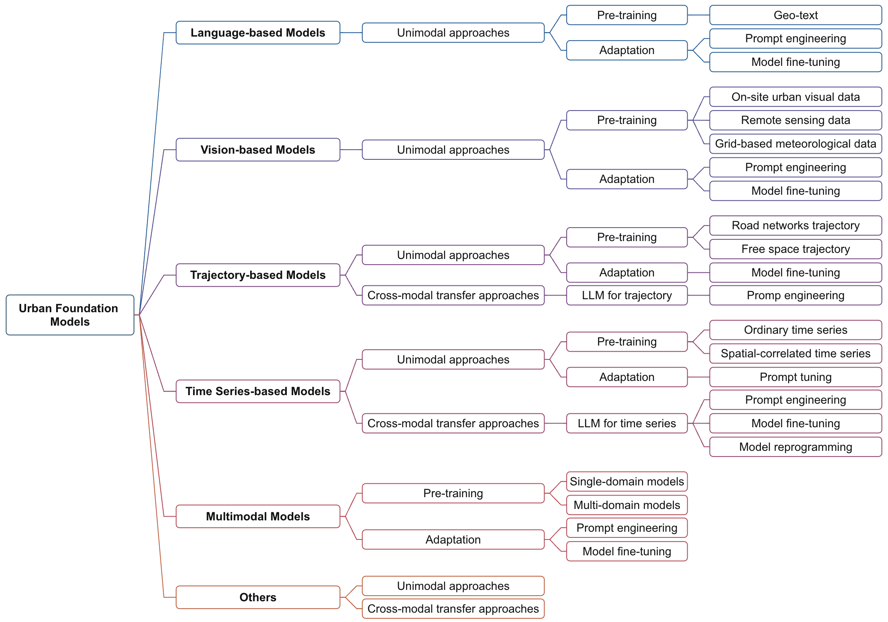

# Awesome-Urban-Foundation-Models

<p align="center">


</p>

An Awesome Collection of Urban Foundation Models (UFMs).


- [Awesome-Urban-Foundation-Models](#awesome-urban-foundation-models)
  - [0-Survey Paper](#0-survey-paper)
  - [1-Language-based Models](#1-language-based-models)
    - [Unimodal Approaches](#unimodal-approaches)
      - [Pre-training](#pre-training)
      - [Adaptation](#adaptation)
  - [2-Vision-based Models](#2-vision-based-models)
    - [Unimodal Approaches](#unimodal-approaches-1)
      - [Pre-training](#pre-training-1)
      - [Adaptation](#adaptation-1)
  - [3-Trajectory-based Models](#3-trajectory-based-models)
    - [Unimodal Approaches](#unimodal-approaches-2)
      - [Pre-training](#pre-training-2)
      - [Adaptation](#adaptation-2)
    - [Cross-modal Transfer Approaches](#cross-modal-transfer-approaches)
  - [4-Time Series-based Models](#4-time-series-based-models)
    - [Unimodal Approaches](#unimodal-approaches-3)
      - [Pre-training](#pre-training-3)
      - [Adaptation](#adaptation-3)
    - [Cross-modal Transfer Approaches](#cross-modal-transfer-approaches-1)
  - [5-Multimodal-based Models](#5-multimodal-based-models)
    - [Pre-training](#pre-training-4)
    - [Adaptation](#adaptation-4)
  - [6-Others](#6-others)
    - [Unimodal Approaches](#unimodal-approaches-4)
    - [Cross-modal Transfer Approaches](#cross-modal-transfer-approaches-2)
  - [7-Contributing](#7-contributing)

## 0-Survey Paper

[**Towards Urban General Intelligence: A Review and Outlook of Urban Foundation Models**](https://arxiv.org/)  

**Authors**: Weijia Zhang, Jindong Han, Zhao Xu, Hang Ni, Hao Liu, Hui Xiong

🌟 If you find this resource helpful, please consider to star this repository and cite our survey paper:

```

```



## 1-Language-based Models

### Unimodal Approaches
#### Pre-training
**Geo-text**
- (*SIGIR'22*) MGeo: Multi-Modal Geographic Language Model Pre-Training [[paper](https://dl.acm.org/doi/abs/10.1145/3539618.3591728)]
- (*KDD'22*) ERNIE-GeoL: A Geography-and-Language Pre-trained Model and its Applications in Baidu Maps [[paper](https://dl.acm.org/doi/pdf/10.1145/3534678.3539021)]

#### Adaptation
**Prompt engineering**
- (*GIScience'23*) Evaluating the Effectiveness of Large Language Models in Representing Textual Descriptions of Geometry and Spatial Relations [[paper](https://arxiv.org/abs/2307.03678)]
- (*SIGSPATIAL'23*) Are Large Language Models Geospatially Knowledgeable? [[paper](https://dl.acm.org/doi/abs/10.1145/3589132.3625625)]
- (*arXiv 2023.05*) Towards Human-AI Collaborative Urban Science Research Enabled by Pre-trained Large Language Models [[paper](https://arxiv.org/abs/2305.11418)]
- (*arXiv 2023.05*) GPT4GEO: How a Language Model Sees the World's Geography [[paper](https://arxiv.org/abs/2306.00020)]
- (*SIGSPATIAL'23 Workshop*) Towards Understanding the Geospatial Skills of ChatGPT: Taking a Geographic Information Systems (GIS) Exam [[paper](https://dl.acm.org/doi/abs/10.1145/3615886.3627745)]
- (*arXiv 2023.10*) Can Large Language Models be Good Path Planners? A Benchmark and Investigation on Spatial-temporal Reasoning [[paper](https://arxiv.org/abs/2310.03249)]
- (*arXiv 2023.10*) GeoLLM: Extracting Geospatial Knowledge from Large Language Models [[paper](https://arxiv.org/abs/2310.06213)]
- (*SIGSPATIAL'22*) Towards a Foundation Model for Geospatial Artificial Intelligence (Vision Paper) [[paper](https://arxiv.org/abs/2306.00020)]
- (*arXiv 2023.05*) On the Opportunities and Challenges of Foundation Models for Geospatial Artificial Intelligence [[paper](https://arxiv.org/abs/2304.06798)]
- (*arXiv 2023.05*) ChatGPT is on the Horizon: Could a Large Language Model be Suitable for Intelligent Traffic Safety Research and Applications? [[paper](https://arxiv.org/abs/2303.05382)]

**Model fine-tuning**
- (*EMNLP'22*) SpaBERT: A Pretrained Language Model from Geographic Data for Geo-Entity Representation [[paper](https://aclanthology.org/2022.findings-emnlp.200/)]
- (*EMNLP'23*) GeoLM: Empowering Language Models for Geospatially Grounded Language Understanding [[paper](https://aclanthology.org/2023.emnlp-main.317/)]
- (*KDD'23*) QUERT: Continual Pre-training of Language Model for Query Understanding in Travel Domain Search [[paper](https://dl.acm.org/doi/abs/10.1145/3580305.3599891)]
- (*TOIS'23*) Improving First-stage Retrieval of Point-of-interest Search by Pre-training Models [[paper](https://dl.acm.org/doi/full/10.1145/3631937)]
- (*arXiv 2023.11*) Optimizing and Fine-tuning Large Language Model for Urban Renewal [[paper](https://arxiv.org/abs/2311.15490)]
- (*arXiv 2023.09*) K2: A Foundation Language Model for Geoscience Knowledge Understanding and Utilization [[paper](https://arxiv.org/abs/2306.05064)]


## 2-Vision-based Models
### Unimodal Approaches
#### Pre-training
**On-site urban visual data**
- (*CVPR'23 Workshop*) Open-TransMind: A New Baseline and Benchmark for 1st Foundation Model Challenge of Intelligent Transportation [[paper](https://openaccess.thecvf.com/content/CVPR2023W/WFM/html/Shi_Open-TransMind_A_New_Baseline_and_Benchmark_for_1st_Foundation_Model_CVPRW_2023_paper.html)]
- (*WWW'23*) Knowledge-infused Contrastive Learning for Urban Imagery-based Socioeconomic Prediction [[paper](https://dl.acm.org/doi/abs/10.1145/3543507.3583876)]
- (*AAAI'20*) Urban2Vec: Incorporating Street View Imagery and POIs for Multi-Modal Urban Neighborhood Embedding [[paper](https://ojs.aaai.org/index.php/AAAI/article/view/5450)]
- (*CIKM'22*) Predicting Multi-level Socioeconomic Indicators from Structural Urban Imagery [[paper](https://dl.acm.org/doi/abs/10.1145/3511808.3557153)]

**Remote sensing data**
- (*arXiv 2023.04*) A Billion-scale Foundation Model for Remote Sensing Images [[paper](https://arxiv.org/abs/2304.05215)]
- (*TGRS'22*) Advancing Plain Vision Transformer Toward Remote Sensing Foundation Model [[paper](https://ieeexplore.ieee.org/abstract/document/9956816)]
- (*TGRS'22*) RingMo: A Remote Sensing Foundation Model With Masked Image Modeling [[paper](https://ieeexplore.ieee.org/abstract/document/9844015)]
- (*TGRS'23*) RingMo-Sense: Remote Sensing Foundation Model for Spatiotemporal Prediction via Spatiotemporal Evolution Disentangling [[paper](https://ieeexplore.ieee.org/abstract/document/10254320)]
- (*ICCV'23*) Scale-MAE: A Scale-Aware Masked Autoencoder for Multiscale Geospatial Representation Learning [[paper](https://openaccess.thecvf.com/content/ICCV2023/html/Reed_Scale-MAE_A_Scale-Aware_Masked_Autoencoder_for_Multiscale_Geospatial_Representation_Learning_ICCV_2023_paper.html)]
- (*arXiv 2023.04*) A Billion-scale Foundation Model for Remote Sensing Images [[paper](https://arxiv.org/abs/2304.05215)]
- (*ICML'23*) CSP: Self-Supervised Contrastive Spatial Pre-Training for Geospatial-Visual Representations [[paper](https://dl.acm.org/doi/10.5555/3618408.3619389)]

**Grid-based meteorological data**
- (*arXiv 2022.02*) FourCastNet: A Global Data-driven High-resolution Weather Model using Adaptive Fourier Neural Operators [[paper](https://arxiv.org/abs/2202.11214)]
- (*Nature'23*) Accurate Medium-range Global Weather Forecasting with 3D Neural Networks [[paper](https://www.nature.com/articles/s41586-023-06185-3)]
- (*ICML'23*) ClimaX: A Foundation Model for Weather and Climate [[paper](https://icml.cc/virtual/2023/28654)]
- (*arXiv 2023.04*) FengWu: Pushing the Skillful Global Medium-range Weather Forecast beyond 10 Days Lead [[paper](https://arxiv.org/abs/2304.02948)]
- (*arXiv 2023.04*) W-MAE: Pre-trained Weather Model with Masked Autoencoder for Multi-variable Weather Forecasting [[paper](https://arxiv.org/abs/2304.08754)]

#### Adaptation
**Prompt engineering**
- (*NeurIPS'23*) SAMRS: Scaling-up Remote Sensing Segmentation Dataset with Segment Anything Model [[paper](https://arxiv.org/abs/2305.02034)]
- (*TGRS'24*) RSPrompter: Learning to Prompt for Remote Sensing Instance Segmentation based on Visual Foundation Model [[paper](https://ieeexplore.ieee.org/abstract/document/10409216)]

**Model fine-tuning**
- (*arXiv 2023.11*) GeoSAM: Fine-tuning SAM with Sparse and Dense Visual Prompting for Automated Segmentation of Mobility Infrastructure [[paper](https://arxiv.org/abs/2311.11319)]
- (*TGRS'23*) RingMo-SAM: A Foundation Model for Segment Anything in Multimodal Remote-Sensing Images [[paper](https://ieeexplore.ieee.org/abstract/document/10315957)]
- (*IJAEOG'22*) Migratable Urban Street Scene Sensing Method based on Vsion Language Pre-trained Model [[paper](https://www.sciencedirect.com/science/article/pii/S1569843222001807)]
- (*arXiv 2023.02*) Learning Generalized Zero-Shot Learners for Open-Domain Image Geolocalization [[paper](https://arxiv.org/abs/2302.00275)]

## 3-Trajectory-based Models
### Unimodal Approaches
#### Pre-training
**Road network trajectory**
- (*ICDE'18*) Deep representation learning for trajectory similarity computation [[paper](https://doi.org/10.1109/ICDE.2018.00062)]
- (*IJCNN'17*) Trajectory clustering via deep representation learning [[paper](https://doi.org/10.1109/IJCNN.2017.7966345)]
- (*TIST'20*) Trembr: Exploring road networks for trajectory representation learning [[paper](https://doi.org/10.1145/3361741)]
- (*CIKM'21*) Robust road network representation learning: When traffic patterns meet traveling semantics [[paper](https://doi.org/10.1145/3459637.3482293)]
- (*IJCAI'21*) Unsupervised path representation learning with curriculum negative sampling [[paper](https://www.ijcai.org/proceedings/2021/0452.pdf)]
- (*KDD'23*) Lightpath: Lightweight and scalable path representation learning [[paper](https://doi.org/10.1145/3580305.3599415)]
- (*ICDM'23*) Self-supervised Pre-training for Robust and Generic Spatial-Temporal Representations [[paper](https://users.wpi.edu/~yli15/Includes/23_ICDM_MingzhiCR.pdf)]
- (*TKDE'23*) Pre-Training General Trajectory Embeddings With Maximum Multi-View Entropy Coding [[paper](https://doi.org/10.1109/TKDE.2023.3347513)]
- (*VLDB'22*) Unified route representation learning for multi-modal transportation recommendation with spatiotemporal pre-training [[paper](https://doi.org/10.1007/s00778-022-00748-y)]
- (*ICDE'23*) Self-supervised trajectory representation learning with temporal regularities and travel semantics [[paper](https://doi.org/10.1109/ICDE55515.2023.00070)]

**Free space trajectory**
- (*KDD'20*) Learning to simulate human mobility [[paper](https://doi.org/10.1145/3394486.3412862)]
- (*KBS'21*) Self-supervised human mobility learning for next location prediction and trajectory classification [[paper](https://doi.org/10.1016/j.knosys.2021.107214)]
- (*AAAI'21*) Pre-training context and time aware location embeddings from spatial-temporal trajectories for user next location prediction [[paper](https://doi.org/10.1609/aaai.v35i5.16548)]
- (*AAAI'23*) Contrastive pre-training with adversarial perturbations for check-in sequence representation learning [[paper](https://doi.org/10.1609/aaai.v37i4.25546)]

#### Adaptation
**Model fine-tuning**
- (*ToW'23*) Pre-Training Across Different Cities for Next POI Recommendation [[paper](https://doi.org/10.1145/3605554)]
- (*CIKM'21*) Region invariant normalizing flows for mobility transfer [[paper](https://doi.org/10.1145/3459637.3482169)]
- (*TIST'23*) Doing more with less: overcoming data scarcity for poi recommendation via cross-region transfer [[paper](https://doi.org/10.1145/3511711)]

### Cross-modal Transfer Approaches
**Prompt engineering**
- (*SIGSPATIAL'22*) Leveraging language foundation models for human mobility forecasting [[paper](https://doi.org/10.1145/3557915.3561026)]
- (*arXiv 2023.08*) Where would i go next? large language models as human mobility predictors [[paper](https://arxiv.org/abs/2308.15197)]
- (*arXiv 2023.10*) Large Language Models for Spatial Trajectory Patterns Mining [[paper](https://arxiv.org/abs/2310.04942)]
- (*arXiv 2023.11*) Exploring Large Language Models for Human Mobility Prediction under Public Events [[paper](https://arxiv.org/abs/2311.17351)]
- (*arXiv 2023.09*) Can you text what is happening? Integrating pre-trained language encoders into trajectory prediction models for autonomous driving [[paper](https://arxiv.org/abs/2309.05282)]
- (*arXiv 2023.10*) Gpt-driver: Learning to drive with gpt [[paper](https://arxiv.org/abs/2310.01415)]
- (*arXiv 2023.10*) Languagempc: Large language models as decision makers for autonomous driving [[paper](https://arxiv.org/abs/2310.03026)]


## 4-Time Series-based Models
### Unimodal Approaches
#### Pre-training
**Ordinary time series**
- (*NeurIPS'23*) SAMRS: Scaling-up Remote Sensing Segmentation Dataset with Segment Anything Model [[paper](https://arxiv.org/abs/2305.02034)]
- (*arXiv 2023.04*) Segment Anything [[paper](https://arxiv.org/abs/2304.02643)]

**Spatial-correlated time series**
- (*NeurIPS'23*) SAMRS: Scaling-up Remote Sensing Segmentation Dataset with Segment Anything Model [[paper](https://arxiv.org/abs/2305.02034)]
- (*arXiv 2023.04*) Segment Anything [[paper](https://arxiv.org/abs/2304.02643)]

#### Adaptation
**Prompt tuning**
- (*NeurIPS'23*) SAMRS: Scaling-up Remote Sensing Segmentation Dataset with Segment Anything Model [[paper](https://arxiv.org/abs/2305.02034)]
- (*arXiv 2023.04*) Segment Anything [[paper](https://arxiv.org/abs/2304.02643)]


### Cross-modal Transfer Approaches
**Prompt engineering**
- (*NeurIPS'23*) SAMRS: Scaling-up Remote Sensing Segmentation Dataset with Segment Anything Model [[paper](https://arxiv.org/abs/2305.02034)]
- (*arXiv 2023.04*) Segment Anything [[paper](https://arxiv.org/abs/2304.02643)]

**Model fine-tuning**
- (*NeurIPS'23*) SAMRS: Scaling-up Remote Sensing Segmentation Dataset with Segment Anything Model [[paper](https://arxiv.org/abs/2305.02034)]
- (*arXiv 2023.04*) Segment Anything [[paper](https://arxiv.org/abs/2304.02643)]

**Model reprogramming**
- (*NeurIPS'23*) SAMRS: Scaling-up Remote Sensing Segmentation Dataset with Segment Anything Model [[paper](https://arxiv.org/abs/2305.02034)]
- (*arXiv 2023.04*) Segment Anything [[paper](https://arxiv.org/abs/2304.02643)]


## 5-Multimodal-based Models
### Pre-training
**Single-domain models**
- (*NeurIPS'23*) SAMRS: Scaling-up Remote Sensing Segmentation Dataset with Segment Anything Model [[paper](https://arxiv.org/abs/2305.02034)]
- (*arXiv 2023.04*) Segment Anything [[paper](https://arxiv.org/abs/2304.02643)]

**Multi-domain models**
- (*NeurIPS'23*) SAMRS: Scaling-up Remote Sensing Segmentation Dataset with Segment Anything Model [[paper](https://arxiv.org/abs/2305.02034)]
- (*arXiv 2023.04*) Segment Anything [[paper](https://arxiv.org/abs/2304.02643)]

### Adaptation
**Prompt engineering**
- (*NeurIPS'23*) SAMRS: Scaling-up Remote Sensing Segmentation Dataset with Segment Anything Model [[paper](https://arxiv.org/abs/2305.02034)]
- (*arXiv 2023.04*) Segment Anything [[paper](https://arxiv.org/abs/2304.02643)]

**Model fine-tuning**
- (*NeurIPS'23*) SAMRS: Scaling-up Remote Sensing Segmentation Dataset with Segment Anything Model [[paper](https://arxiv.org/abs/2305.02034)]
- (*arXiv 2023.04*) Segment Anything [[paper](https://arxiv.org/abs/2304.02643)]


## 6-Others
### Unimodal Approaches
- (*NeurIPS'23*) SAMRS: Scaling-up Remote Sensing Segmentation Dataset with Segment Anything Model [[paper](https://arxiv.org/abs/2305.02034)]
- (*arXiv 2023.04*) Segment Anything [[paper](https://arxiv.org/abs/2304.02643)]

### Cross-modal Transfer Approaches
- (*NeurIPS'23*) SAMRS: Scaling-up Remote Sensing Segmentation Dataset with Segment Anything Model [[paper](https://arxiv.org/abs/2305.02034)]
- (*arXiv 2023.04*) Segment Anything [[paper](https://arxiv.org/abs/2304.02643)]


## 7-Contributing

👍 Contributions to this repository are welcome! 

If you have come across relevant resources, feel free to open an issue or submit a pull request.
```
- (*conference|journal*) paper_name [[pdf](link)][[code](link)]
```
